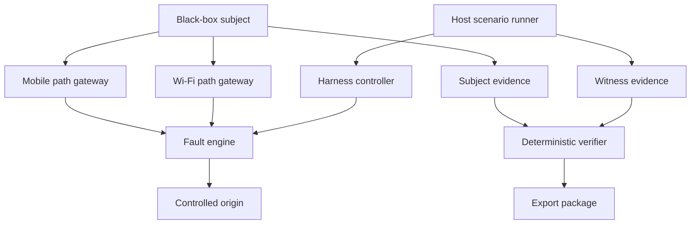

# VRP Docker Evidence Lab

## 1. Purpose

The VRP Docker Evidence Lab defines a public, reproducible, black-box method for evaluating externally observable continuity behavior.

The lab exists to answer a narrow engineering question:

> Did the supplied subject produce evidence consistent with the declared public invariants during this bounded scenario?

It does not publish, reproduce, approximate, or reverse-engineer the protected VRP runtime.

The lab separates observable behavior from protected implementation.

## 2. Evaluation Principle

Continuity claims must be connected to:

- a declared scenario;
- controlled fault events;
- independently recorded witness events;
- ordered subject observations;
- a versioned invariant contract;
- deterministic verification;
- an exportable evidence package.

A runtime statement is not accepted as proof by itself.

A harness event is also not sufficient by itself.

A valid decision requires consistency between the harness, subject, manifest, contract, and verifier.

## 3. What Docker Contributes

Docker provides the controlled evaluation environment.

It provides:

- isolated logical network paths;
- a controlled origin;
- a harness-controlled fault engine;
- repeatable path enable and disable operations;
- separation between data and control planes;
- bounded subject execution;
- evidence-directory isolation;
- stable orchestration;
- reproducible container-image identity;
- automatic cleanup of run-specific infrastructure.

Docker does not implement VRP.

Docker does not decide whether continuity was preserved.

Docker does not provide the protected runtime mechanism.

Docker only creates a controlled environment in which public behavior can be observed.

## 4. What Docker Does Not Emulate

The logical path names `wifi` and `mobile` are evaluation labels.

They do not reproduce the complete behavior of:

- IEEE 802.11 radio systems;
- cellular-radio handover;
- modem firmware;
- carrier NAT;
- mobile-core networks;
- physical interference;
- real access-point roaming;
- device power loss;
- production routing infrastructure.

The Docker lab is a deterministic evidence stage before real-network and participant-environment validation.

## 5. Architecture



## 6. Isolation Zones

### 6.1 Host Runner

The host runner is responsible for:

- parsing the selected scenario;
- creating a unique run identifier;
- starting isolated Docker infrastructure;
- configuring the fault engine;
- starting the authorized subject;
- delivering scheduled public stimuli;
- recording witness events;
- stopping the subject;
- capturing artifact hashes;
- removing run-specific containers and networks.

The host and Docker daemon are part of the trusted computing base.

### 6.2 Harness Control Plane

The control plane contains:

- the scenario runner;
- the controller container;
- the fault-engine control endpoint.

The subject is not attached to this network.

The subject cannot directly change path state through the fault-engine API.

### 6.3 Logical Data Planes

The subject is attached only to:

- `wifi-plane`;
- `mobile-plane`.

Each path is exposed through a separate gateway.

The path gateways forward only data-plane traffic toward the fault engine.

### 6.4 Origin Plane

The origin plane contains the deterministic test origin.

The origin remains isolated from the host and subject except through the declared path topology.

For path and blackout scenarios, the origin remains healthy so that path failure can be distinguished from origin failure.

### 6.5 Evidence Compartments

The subject receives write access only to:

```text
out/<run-id>/subject/
```

The subject cannot write to:

```text
out/<run-id>/input/
out/<run-id>/witness/
out/<run-id>/report/
out/<run-id>/manifest.json
out/<run-id>/verification.json
```

Scenario configurations and expected invariants are not mounted into the subject.

## 7. Container Security Boundary

The Compose topology does not provide containers with:

- privileged mode;
- host networking;
- the Docker socket;
- host PID namespace access;
- protected runtime source mounts;
- production credentials;
- host port publication.

Services use:

- internal Docker bridge networks;
- read-only root filesystems;
- dropped Linux capabilities;
- `no-new-privileges`;
- bounded process counts;
- bounded memory and CPU allocations;
- temporary writable storage only where required.

These controls reduce accidental coupling and disclosure. They do not make a compromised Docker host trustworthy.

## 8. Black-Box Subject Boundary

The protected runtime is supplied separately as an authorized black-box adapter image.

The public repository does not distribute that image.

The default adapter entrypoint is:

```text
/vrp-lab-adapter
```

The adapter supports:

```text
/vrp-lab-adapter run
/vrp-lab-adapter health
/vrp-lab-adapter stimulus --kind <kind> --event-id <event-id>
```

The adapter receives only public execution inputs:

| Variable | Purpose |
|---|---|
| `VRP_LAB_CONTRACT_VERSION` | Select the public adapter contract |
| `VRP_LAB_RUN_ID` | Bind evidence to one run |
| `VRP_LAB_RUN_DURATION_SECONDS` | Bound subject execution |
| `VRP_LAB_PRIMARY_ENDPOINT` | Primary logical-path endpoint |
| `VRP_LAB_ALTERNATE_ENDPOINT` | Alternate logical-path endpoint |
| `VRP_LAB_EVIDENCE_DIRECTORY` | Subject-only evidence output |
| `VRP_LAB_EVIDENCE_FORMAT` | Select the public evidence format |

The adapter must not export protected implementation material.

## 9. Evidence Layers

### 9.1 Scenario Snapshot

The runner copies the selected scenario into:

```text
input/scenario.yaml
```

The snapshot becomes immutable input evidence for that run.

Changing the repository scenario later does not alter the captured snapshot.

### 9.2 Schedule Snapshot

The validated scenario timeline is normalized into:

```text
input/schedule.tsv
```

Only supported public actions are permitted:

- `path.disable`;
- `path.enable`;
- `paths.disable`;
- `paths.enable`;
- `subject.stimulus`.

Supported public stimulus kinds are:

- `stale-authority`;
- `replay`.

### 9.3 Invariant-Contract Snapshot

The selected public contract is copied into:

```text
input/invariant-contract.json
```

Scenario files reference it as:

```text
../expected/invariant-contract.json
```

The copied contract is bound into the run manifest by SHA-256.

### 9.4 Witness Evidence

The harness records:

```text
witness/events.jsonl
witness/environment.json
```

Witness events describe actions performed by the harness.

Examples include:

- infrastructure ready;
- subject ready;
- logical path disabled;
- logical path enabled;
- blackout started;
- blackout ended;
- stimulus requested;
- stimulus delivered;
- subject completed;
- run completed.

Witness evidence does not describe protected runtime state.

### 9.5 Subject Evidence

The subject produces:

```text
subject/subject-evidence.json
subject/subject-events.jsonl
```

The summary contains public counters and the final observable state.

The event stream contains ordered public observations.

The subject event stream may expose only opaque public references. It must not export the protected objects represented by those references.

### 9.6 Run Manifest

The runner generates:

```text
manifest.json
```

The manifest binds:

- run identifier;
- scenario identifier;
- execution state;
- start and completion time;
- scenario snapshot;
- normalized schedule;
- invariant contract;
- environment evidence;
- witness events;
- subject summary;
- subject events.

Each bound artifact is identified by its relative path and SHA-256 digest.

SHA-256 binding detects post-capture modification. It does not independently establish authorship, trusted time, or cryptographic provenance.

### 9.7 Verification Result

The verifier generates:

```text
verification.json
```

The verifier evaluates only public evidence and public invariant definitions.

It does not execute protected logic.

### 9.8 Export Package

The exporter creates an allowlisted evidence package.

The package excludes:

- protected source code;
- runtime binaries;
- registry credentials;
- cryptographic keys;
- raw protected packets;
- private authority material;
- container logs;
- unexpected run-directory files.

## 10. Scenarios

| Scenario | Controlled stimulus | Primary observation |
|---|---|---|
| `wifi-to-mobile` | Disable primary logical path | Alternate path becomes active while continuity reference remains stable |
| `blackout-recovery` | Disable both paths, then restore alternate path | Progress resumes within the recovery bound without continuity-reference replacement |
| `stale-authority` | Deliver one opaque stale-authority stimulus | Public rejection verdict with no linked accepted mutation |
| `replay-attempt` | Replay one opaque artifact linked to a prior accepted operation | Replay rejection with no additional accepted mutation |

The stale-authority and replay scenarios expose only public correlation identifiers.

The harness does not receive or decode the protected authority or replay artifacts.

## 11. Public Evidence Model

### 11.1 Continuity Reference

The continuity reference is an opaque public identifier used only to determine whether the same public continuity context was observed throughout the run.

It must not contain:

- credentials;
- key material;
- protected tokens;
- serialized internal state;
- recoverable private identifiers.

A stable continuity reference is evidence of stable public identity within the declared run. It does not reveal how that identity is maintained internally.

### 11.2 Public Operation Reference

A public operation reference links:

- one accepted mutation;
- one later replay attempt;
- the replay rejection verdict.

The reference is not the protected operation artifact.

It must not contain a payload, authorization object, or internal serialization.

### 11.3 Witness Correlation

A subject stimulus verdict uses:

```text
related_witness_event_id
```

This field links the subject observation to the harness event that requested the public stimulus.

The relationship allows the verifier to distinguish stimulus-related observations from unrelated workload activity.

## 12. Verification Model

The verifier checks:

- required artifact presence;
- file-size bounds;
- JSON and JSONL validity;
- schema compatibility;
- artifact hashes;
- run-identifier consistency;
- monotonic event sequencing;
- event-identifier uniqueness;
- summary-counter consistency;
- prohibited evidence fields;
- continuity-reference stability;
- scenario-specific acceptance conditions;
- contract coverage.

The verifier never fills in missing observations.

The verifier never converts absence of evidence into success.

## 13. Verdict Semantics

### PASS

`PASS` means:

- every global invariant passed;
- every scenario-required invariant passed;
- artifact integrity checks passed;
- required evidence was complete;
- the public observations were mutually consistent.

`PASS` is bound to:

- one run identifier;
- one scenario snapshot;
- one invariant-contract digest;
- one subject-image identity;
- one recorded Docker environment.

### FAIL

`FAIL` means at least one required public invariant was contradicted.

Examples include:

- artifact hash mismatch;
- inconsistent run identifiers;
- duplicate accepted mutation;
- continuity-reference replacement;
- missing required rejection verdict;
- replay acceptance;
- recovery outside the configured bound.

### INCOMPLETE

`INCOMPLETE` means the verifier could not make a valid final decision.

Examples include:

- missing required artifact;
- unsupported schema;
- missing witness event;
- incomplete stimulus delivery;
- infrastructure failure;
- unsupported invariant;
- truncated event stream.

When both `FAIL` and `INCOMPLETE` conditions are present, `FAIL` takes precedence.

## 14. Execution Workflow

Change to the Docker lab directory:

```bash
cd docker/continuity-lab
```

Select an authorized subject image:

```bash
export VRP_LAB_SUBJECT_IMAGE='registry.example/authorized-subject@sha256:<digest>'
```

Set the evidence-output identity:

```bash
export VRP_LAB_SUBJECT_UID="$(id -u)"
export VRP_LAB_SUBJECT_GID="$(id -g)"
```

For digest-enforced evaluation:

```bash
export VRP_LAB_REQUIRE_DIGEST=1
```

Run a scenario:

```bash
./scripts/run-scenario.sh configs/wifi-to-mobile.yaml
```

Verify the captured evidence:

```bash
./scripts/verify-evidence.sh out/<run-id>
```

Export the allowlisted report:

```bash
./scripts/export-report.sh out/<run-id>
```

The execution step captures evidence. It does not return the final acceptance verdict.

The verification step returns the verdict.

## 15. Exit Codes

### Scenario Runner

| Exit code | Meaning |
|---|---|
| `0` | Scenario execution completed and required subject artifacts were captured |
| non-zero | Execution was incomplete or the subject failed |

A runner exit code of `0` is not equivalent to a verification `PASS`.

### Evidence Verifier

| Exit code | Meaning |
|---|---|
| `0` | `PASS` |
| `1` | `FAIL` |
| `2` | `INCOMPLETE` |
| `64` | Invalid command usage |

### Report Exporter

| Exit code | Meaning |
|---|---|
| `0` | Allowlisted evidence package exported |
| non-zero | Export refused or failed |

The exporter refuses to package evidence unless the disclosure, schema, integrity, and run-identity safety gates passed.

A behavioral `FAIL` may still be exported when those safety gates remain valid.

## 16. Reproducibility

A comparable rerun requires:

- the same scenario snapshot;
- the same invariant-contract digest;
- the same subject-image digest;
- the same harness-image digests;
- the same public adapter-contract version;
- comparable resource limits;
- a recorded Docker environment.

Every run must use a new run identifier.

Evidence from different runs must not be merged.

Event order is determined by sequence numbers.

Timestamps are used for bounded recovery relationships, not for global distributed ordering.

## 17. Deterministic Export

The exporter:

- copies only allowlisted artifacts;
- regenerates a human-readable summary;
- generates artifact checksums;
- normalizes archive ownership;
- normalizes archive timestamps;
- sorts archive paths;
- disables gzip timestamp metadata;
- computes the final archive SHA-256 digest.

Unexpected files in the run directory are not exported.

The export package does not include the protected subject image.

## 18. Failure Classification

| Condition | Classification |
|---|---|
| Harness cannot establish infrastructure | `INCOMPLETE` |
| Subject never becomes ready | `INCOMPLETE` |
| Stimulus cannot be delivered | `INCOMPLETE` |
| Required evidence is missing | `INCOMPLETE` |
| Artifact hash differs from manifest | `FAIL` |
| Run identifiers contradict each other | `FAIL` |
| Required public rejection is absent | `FAIL` |
| Duplicate accepted mutation is observed | `FAIL` |
| Continuity reference changes unexpectedly | `FAIL` |
| Protected evidence field is detected | `FAIL` and export refusal |
| Required invariant has no evaluator | `INCOMPLETE` |

## 19. Threat Model

The lab protects against accidental or direct mixing of:

- scenario control and subject execution;
- expected invariants and subject output;
- witness evidence and subject evidence;
- unrelated run artifacts;
- protected implementation and public validation material.

The lab does not protect against:

- a compromised Docker daemon;
- a malicious host administrator;
- kernel compromise;
- forged evidence created outside the lab;
- replacement of every artifact and verifier by a malicious operator;
- compromised container images;
- physical-host tampering;
- external time-source manipulation.

Stronger provenance requires controls outside this public lab, such as:

- signed evidence;
- independent timestamping;
- measured boot;
- hardware-backed attestation;
- controlled image delivery;
- independent observers;
- participant-controlled infrastructure.

Those controls are not claimed by this public Docker layer.

## 20. Intellectual-Property Boundary

The public lab defines:

- stimuli;
- evidence formats;
- correlation rules;
- acceptance criteria;
- verification behavior;
- report structure.

It does not define:

- the protected continuity mechanism;
- internal authority calculations;
- private recovery logic;
- cryptographic key derivation;
- internal replay-window structures;
- private runtime state;
- production packet-processing algorithms.

The purpose is to make claims testable without making the protected mechanism public.

## 21. Correct Result Language

A result should be described as:

> Subject image identity `<digest>` returned PASS under scenario `<scenario-id>`, invariant contract `<digest>`, and run `<run-id>`.

A result should not be described as:

> VRP has been universally proven.

The first statement is bounded and reproducible.

The second statement exceeds the available evidence.

## 22. Relationship to Participant Validation

The Docker lab is an entry evaluation layer.

A complete participant evaluation may additionally include:

- real Wi-Fi and cellular transitions;
- NAT rebinding;
- long-duration blackout;
- host restart;
- process restart;
- multi-node contention;
- participant traffic;
- participant observability;
- security review;
- production-like resource pressure.

Those stages require separate authorization, evidence boundaries, and acceptance criteria.

The Docker lab does not silently extend its verdict to those environments.

## 23. Versioning

Changes that alter evidence meaning, required fields, verdict precedence, or invariant semantics require a new contract version.

Backward-compatible documentation clarifications may retain the existing contract version.

A verifier must fail closed when it encounters:

- an unsupported scenario schema;
- an unsupported evidence schema;
- an unsupported contract version;
- an unknown required invariant.

Historical evidence must remain bound to the contract snapshot captured during its original run.

## 24. Final Boundary

The Docker Evidence Lab demonstrates a method:

```text
controlled stimulus
→ independent witness
→ black-box observation
→ immutable run binding
→ deterministic verification
→ allowlisted export
```

It provides a public evaluation surface.

It does not provide the protected architecture behind that surface.